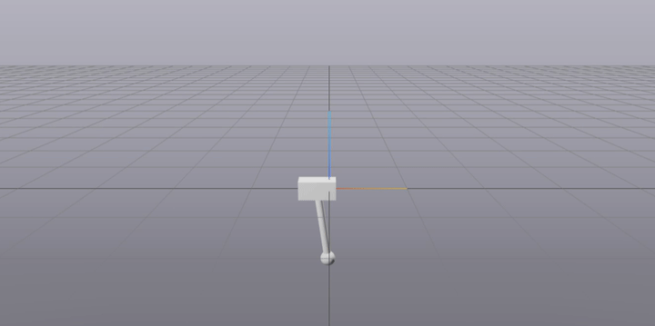
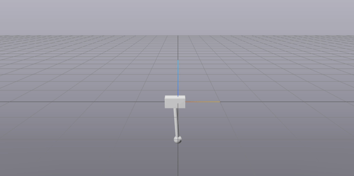
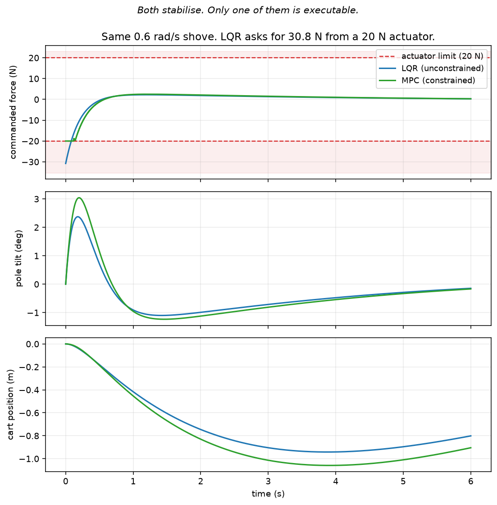

# Cart-Pole Control

[](https://github.com/paeb37/robotics/actions/workflows/ci.yml)

Swing-up and constrained balancing of an underactuated cart-pole, built on
[Drake](https://drake.mit.edu). Trajectory optimization plans the swing-up, LQR
catches it at the top, and model-predictive control balances it (while respecting
the actuator and track limits). The MPC loop has a C++ implementation behind a
C ABI, benchmarked against the Python one in the same control loop (results below).

| Open-loop | With feedback |
|:--:|:--:|
|  |  |
| The planned forces replayed blind. The swing-up itself is correct — then the pole is lost near the top and the cart leaves the frame. | The **identical** forces, for the first 4.3 s. Then feedback takes over and controls it. |

*Note: Both clips run at 4× speed and start from the same state. Error near the unstable equilibrium grows as `e^(4.65t)`, doubling every 149 ms.*

---

## The system

A cart on a rail with a freely-swinging pole. Two configuration variables
(`x`, `θ`) and **one actuator** - a force on the cart. Nothing acts on the pole
directly, so `rank(B) = 1 < 2`: the system is underactuated everywhere, and there
is no torque you can command that cancels the pole's dynamics.

The upright equilibrium is unstable with eigenvalue `λ = +4.6456 1/s`, so a
deviation **doubles every 149 ms**. That number sets the later things like the
control rate, the MPC horizon, and the acceptable solve time.

## What it does

**1. Swing-up by direct collocation.** From hanging at rest to upright at rest,
subject to constraint `|u| ≤ 20 N`. The solver is handed the force limit and produces an 11.78 s trajectory with **eight pumping swings** — it discovers pumping on its own because at 20 N it cannot simply lift the pole.

**2. Open-loop execution fails.** Replaying the planned forces (computed offline)
without feedback loses the pole every time, as shown. The reason is because the error near the upright pos grows as `e^(4.65t)`, so surviving six seconds of it
would require seeding an error below `1e-14` (machine epsilon). **So open-loop
execution near an unstable equilibrium is impossible, not just
inaccurate.**

**3. LQR catches and controls it.** The controller hands off from the plan to LQR once the state enters the "region of attraction" - I tested with the LQR cost-to-go,
`V(x) = eᵀSe ≤ ρ`, because the basin is a 4D region.

**4. MPC balances it within limits.** Force and track limits are rows in a
quadratic program (re-solved every 10 ms).

## Results

### The limits are real, but only one controller knows it



Given the same disturbance, LQR commands **30.8 N from our 20 N actuator**. So that
command cannot be executed. MPC has the limit in its QP and plans within it.

LQR gets worse in a way that is easy to miss when reading only the angle:

| initial tilt | LQR outcome |
|---|---|
| ≤ 1.2 rad (69°) | recovers, cart settles at 0.00 m |
| 1.3 rad (74°) | pole nearly recovered - 353 m down the track |
| 2.0 rad (115°) | commands 474 N, cart reaches 359 m |

As a result, it results in failure of the cart running away, not dropping the pole.

### My honest finding: MPC is not always faster or better here

I expected MPC to outperform LQR. However, across `u_max` from 6–12 N and disturbances from 0.3–0.6 rad/s, both recover every time, and MPC generally uses slightly more track distance.

MPC does, however, guarantee constraints:

- its command respects the force limit, whereas LQR must be
  clipped afterwards
- it can express a track limit, which LQR structurally cannot

### C++ backend

Same `LeafSystem`, same diagram, same closed loop - only the QP solver differs,
so the comparison is fair. Full per-step cost (construction + solve),
first 20 solves discarded as warmup:

| disturbance | backend | p50 | p99 | max | over 10 ms |
|---|---|---|---|---|---|
| 0.3 rad/s | python | 2.160 ms | 2.963 ms | 3.627 ms | 0 / 980 |
| 0.3 rad/s | **c++** | **0.176 ms** | 0.696 ms | 1.636 ms | 0 / 980 |
| 1.0 rad/s | python | 1.492 ms | 2.717 ms | 3.523 ms | 0 / 980 |
| 1.0 rad/s | **c++** | **0.178 ms** | 1.626 ms | 12.634 ms | 1 / 980 |

**8–12× on the median** - 0.176 ms at every disturbance level.

**But the C++ extreme case is actually worse.** Two solves exceed the 10 ms control period at higher disturbances, which Python never does. Those are ADMM iteration bursts at active-set transitions.

## How it works

```
cartpole/
  model.py        the "plant": SDF, joint names, constants, state helpers
  lqr.py          LQR design and linearization
  swingup.py      direct collocation -> a trajectory (data, not a controller)
  controllers.py  Systems that plug into a Diagram (drake)
  mpc.py          constrained MPC, python or c++ backend
  cpp_backend.py  ctypes bridge
  sim.py          diagram assembly -- names no controller
cpp/              Eigen + OSQP solver behind a flat C ABI
```

The dependency graph is a DAG with `sim.py` depending only on `model.py`. Adding
a controller touches `controllers.py` and a script - never the simulator.

`swingup.py` returns a *trajectory* rather than a controller, so the optimizer's output can be inspected, asserted on and cached without building a diagram. And the C++ boundary is a flat C ABI called via `ctypes`, not pybind11: only plain doubles cross it, so there is no ABI coupling to pydrake's build, and it is the same interface you would ship to a microcontroller. The library exports exactly four symbols; OSQP is statically linked with hidden visibility so it cannot collide with the copy inside `libdrake.so`.

## Setup

Requires macOS 15+ (arm64) or Ubuntu 24.04/26.04, Python 3.13 or 3.14. On macOS
use Homebrew Python - Drake does not support Apple's system Python.

```bash
git clone https://github.com/paeb37/robotics.git
cd robotics

python3 -m venv .venv
source .venv/bin/activate
pip install -e ".[dev]"
```

Verify:

```bash
python -c "
import pydrake.all
from pydrake.solvers import OsqpSolver, SnoptSolver, IpoptSolver
print('OSQP', OsqpSolver().available(), '| SNOPT', SnoptSolver().available(),
      '| IPOPT', IpoptSolver().available())"
```

The C++ backend is optional:

```bash
brew install cmake eigen          # or: apt install cmake libeigen3-dev
cmake -S cpp -B build -DCMAKE_BUILD_TYPE=Release
cmake --build build
```

## Docker

Multi-stage: the C++ solver is compiled in a builder image and only its shared
library is carried into the runtime, so the runtime ships no compiler, no Eigen
and no OSQP sources. The build ends in a test that solves a QP through
both backends and compares them - a broken image fails the build rather than
shipping.

```bash
docker build -t cartpole-control .
docker run --rm cartpole-control                    # latency benchmark
docker run --rm cartpole-control python scripts/compare_lqr_mpc.py
```

~500 MB, almost entirely pydrake. Ubuntu 24.04 because that is a Drake-supported
platform; note Drake also needs `libx11-6 libsm6 libglib2.0-0t64` at runtime even
headless, or `import pydrake` fails.

## Tests

```bash
pytest                # 38 tests, ~2.5 s
pytest -m slow        # also re-solves the trajectory optimisation (minutes)
```

The swing-up trajectory is committed rather than re-solved. Several
tests check for bugs that actually happened - MPC matching LQR when unconstrained
(which would have caught a `dt` scaling error), and QP feasibility with the cart
outside the track (which would have caught hard state constraints).

## Running

```bash
python scripts/demo_swingup_lqr.py    # swing-up: open-loop vs feedback
python scripts/demo_disturbance.py    # limits, and what ignoring them costs
python scripts/basin_sweep.py         # measure LQR's region of attraction
python scripts/compare_lqr_mpc.py     # LQR vs MPC constraint satisfaction
python scripts/bench_mpc.py           # latency, python vs c++
python scripts/plot_force.py          # regenerate the force figure
```

Visualization is served by MeshCat at a local URL printed on startup. Demo
scripts pause between acts; pass `--headless` for numbers only.

## Next steps / what I would do differently

**Fix the latency tail before the median.** The C++ backend is 8–12× faster
typically but occasionally blows the deadline

**Stabilize the swing-up trajectory.** The first 4.3 s are open-loop with no
disturbance rejection at all. TVLQR along the trajectory would help close that gap

**Model error.** Everything here plans and executes against the same model. Changing the plant's masses relative to the controller's model would be an interesting next experiment

## Background

I first learned the control theory from MIT's
[Underactuated Robotics](https://underactuated.csail.mit.edu/index.html)
(Russ Tedrake). I worked through these chapters:
- underactuation and feedback equivalence (Ch. 1)
- cart-pole dynamics and partial feedback linearization (Ch. 3)
- LQR and trajectory stabilization (Ch. 8)
- trajectory optimization and receding-horizon control (Ch. 10)
- convex optimization (Ch. 24 / Appendix)

Then I applied my learnings to a real project, shown here

## Notes

Development notes, including the bugs and what they taught, are in
[notes/NOTES.md](notes/NOTES.md). The ones worth knowing about: a `dt` factor
that made MPC 10× too timid and was caught only by an equivalence check against
LQR; hard state constraints that made 1125 of 1200 QPs infeasible; and IEEE
`infinity()` where OSQP wanted its own sentinel, which broke convergence at every
tolerance.

## License

MIT
